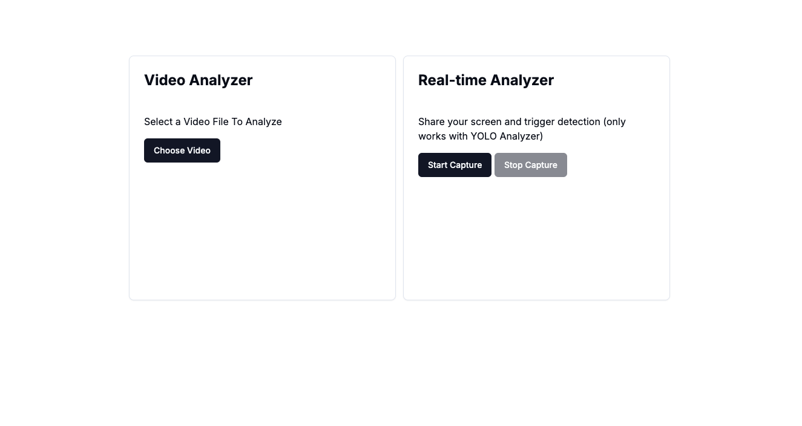

# Video Stream Processing for Exam-Fraud Detection
This is a [Next.js](https://nextjs.org/) project for video-stream processing for fraud detection. The application allows the user to upload videos or share the screen for real-time analysis. It detects suspicious activities like the use of ai assistants or chat applications solely based on the video or screen sharing provided.

## Getting Started

First, run the development server:

```bash
yarn run dev
```

Open [http://localhost:3000](http://localhost:3000) on your browser to see the page.

## AnalyzeVideo



You will be greeted with the following page giving you two options. You can either test the different analyzers using the Video Analyzer Card or test out the best model in an-exam like scenario using the Real-time Analyzer card.

### Video Analyzer Card
Press "Choose Video" to select a video from your local machine. Once you have selected a video, you can choose an Analyzer from a drop down menu. Finally press "Analyze" to start the analysis. In case a suspicious activity is detected, the analyzer will automatically log it and trigger a download to your system with the suspicious activity labeled (OCR will only show detected words in the Results section. Finally you can remove the video and replace it with a new one by pressing the "Remove Video" button.

### Real-time Analyzer Card
Press "Start Capture" to initialize the real-time analysis. You will be prompted by the browser to share your screen. Upon sharing your screen, the analysis will begin. When using the real-time Analyzer the YOLO Analyzer will automatically be selected, since it si the only Analyzer that can operate at real-time speeds. If a suspicious window is detected, the analyzer will automatically log it and trigger a download to your system with the suspicious activity labeled. To stop the analysis press the "Stop Capture" button. 